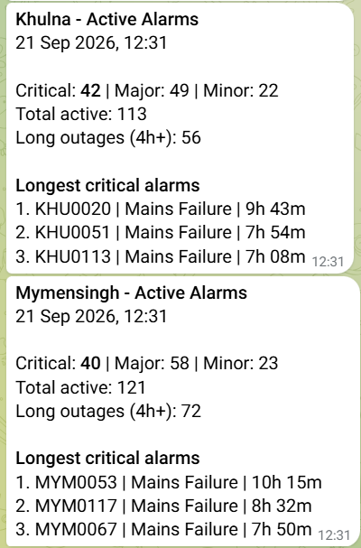
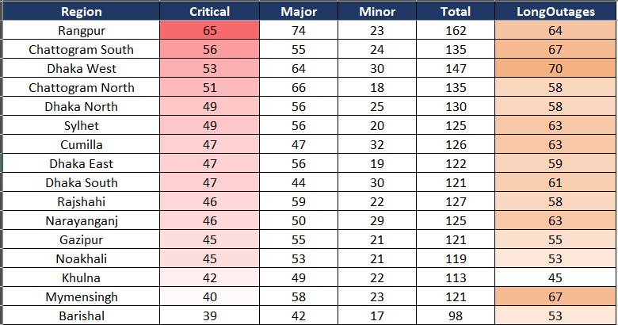
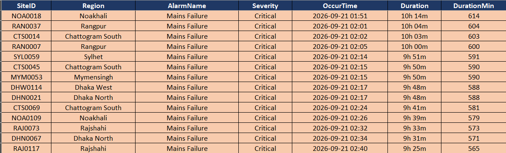

# 🚨 Telecom Alarm Pipeline (Demo)

Sanitized showcase of a production alarm-notification pipeline I built for a 24×7 telecom operations centre. The original processes 10,000+ alarm records every 10 minutes and sends region-wise alerts to 16 operations teams.

> All data here is **synthetic**. No real site IDs, operators, endpoints or company code are included.

## Roadmap

- [x] Synthetic alarm dataset generator (10,000 alarms, 16 regions)
- [x] Alarm processing with pandas (validation, active alarms, long outages, region summary)
- [x] Formatted Excel report
- [x] Region-wise Telegram notifications
- [ ] Scheduled run on GitHub Actions

## Try it

```bash
pip install -r requirements.txt
python generate_sample_data.py
python notify.py --dry-run
```

`--dry-run` builds the Excel report and prints every Telegram message without sending anything. To send for real, create a `.env` file with `TELEGRAM_TOKEN` and `TELEGRAM_CHAT_ID`, then run `python notify.py`.

## Telegram notifications

Each run sends one nationwide overview, one message per region (16 in total) and the full Excel report as an attachment. Every region message lists its active alarms by severity, its long outages and its three longest-running critical alarms.



In production each region posts to its own operations group. `REGION_CHAT_IDS` in `notify.py` maps a region to a chat; unmapped regions fall back to the default chat. Messages are rate-limited to stay under Telegram's per-chat limit.

## Excel report

| Sheet | Contents |
|---|---|
| Summary | Record counts, active and critical alarms, long outages, data-quality results |
| Regions | Active alarms per region by severity, with heat-map colouring on Critical and long-outage columns |
| Long Outages | Every alarm active for 4+ hours, critical first, rows coloured by severity |
| Top Sites | Sites with the most active alarms right now |

Every sheet has a frozen header, filters and auto-sized columns.

**Regions** — active alarms per region, heat-mapped by critical count:



**Long Outages** — critical alarms first, rows coloured by severity:



## Data quality checks

Real portal exports are never clean, so the generator deliberately injects common problems and the processor catches and removes them before any report is built:

| Check | Injected | Caught |
|---|---|---|
| Duplicate alarm IDs | 15 | 15 |
| Missing occur time | 10 | 10 |
| Clear time before occur time | 8 | 8 |
| Unknown severity | 5 | 5 |

10,015 raw records → 9,977 clean records.

## Project structure

| File | Role |
|---|---|
| `generate_sample_data.py` | Builds the synthetic alarm dataset with injected data-quality issues |
| `processor.py` | Loads, validates, cleans and summarises the alarms |
| `excel_report.py` | Writes the formatted multi-sheet workbook |
| `formatter.py` | Builds the overview and per-region Telegram messages |
| `notifier.py` | Reusable Telegram client (messages and documents) |
| `notify.py` | Runs the full pipeline and sends the notifications |

## Author

**Md. Mahabubul Hasan** — [@mahabub-automation](https://github.com/mahabub-automation) · [LinkedIn](https://linkedin.com/in/mahabubulhasan)